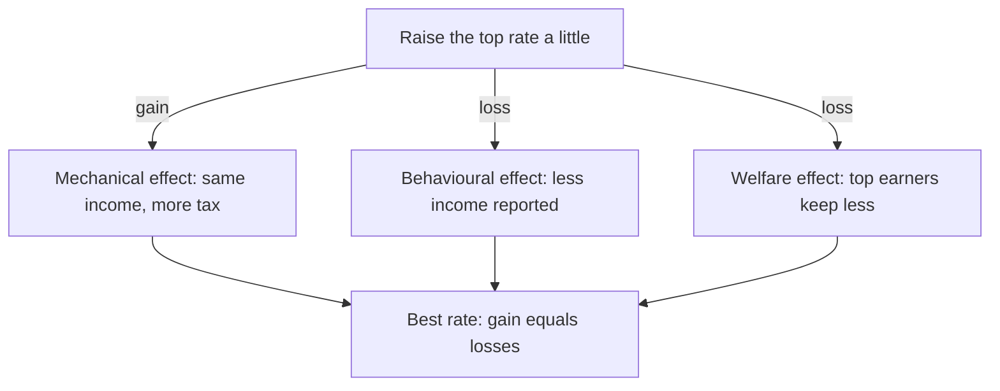

# How high should the top tax rate be?

*Three numbers settle one of the oldest fights in tax policy, and most of the fight is about just one of them.*

Saez (2001) · Skim depth

Meet a surgeon who earns $1.8 million a year. In 2024 she pays 37 cents in federal tax on each dollar she earns above $609,350. Some economists say that rate should be closer to 70%; others say it is already too high. Both sides claim economics is on their side. So who is right, and what would it take to know?

Emmanuel Saez's answer is surprising: the best top rate follows from just three numbers, and two of them are close to settled. Let's start with the small question he asks in place of "which rate?".

## Raise the rate a little, and three things happen

Here is the turn that makes the problem tractable. Instead of searching over every possible rate, Saez asks one small question: what happens if the current [[top-tax-rate|top rate]] rises by one small step?

Three things happen to our surgeon and everyone like her. The government gains, because she pays more on the same income; this is the [[mechanical-effect|mechanical effect]]. The government also loses, because she may report a little less income, so there is less to tax; this is the [[elasticity-of-taxable-income|behavioural response]]. And she loses too, by keeping less of what she earns. How much that last loss counts depends on how much society values her extra dollar.

*What to notice:* one gain and two losses. If the gain is bigger, raise the rate; if the losses are bigger, lower it. The best rate is where they balance.[^foc]

So the question becomes: how big is each side? Two things decide it. Take the gain first.

## The gain depends on how far top incomes reach

The top rate only taxes income above the top line, $\bar z$. For our surgeon that is the $1.2 million she earns above roughly $600,000, so the gain from a higher rate depends on how far incomes like hers stretch past the line.

You might expect that to need the whole income distribution. It does not, because top incomes follow a [[pareto-tail|Pareto tail]], a shape set by one number $a$: the smaller $a$, the fatter the tail and the further top incomes reach. The average income above the line is then

$$ z_m = \frac{a}{a-1}\,\bar z $$

Where:

- $z_m$ is the average income above the line.
- $a$ is the Pareto tail; small means fat.
- $\bar z$ is the line where the top rate starts.

(Source: p. N, sample)

With $a = 1.5$, the average top earner makes three times the line. That is our surgeon: $1.8 million against a $600,000 line. US tax data pin $a$ down well, so the gain side is close to settled.

## The loss depends on how much reported income shrinks

Now the hard part. If the top rate rises and our surgeon keeps 10% less of each extra dollar, how much less income does she report? That response is the [[elasticity-of-taxable-income|elasticity of taxable income]], $e$: reported income falls by $e \times 10\%$. At $e = 0.25$ she reports 2.5% less, about $45,000.

You might expect economists to agree on $e$ by now. They do not. Estimates run from about 0.1 to above 1, and this is the heart of the paper, because the formula turns that disagreement directly into a disagreement about the rate.

> Most of the fight over top tax rates is a fight over one number: $e$.

## The whole argument in symbols

We now hold all three pieces: the gain, set by $a$; the behavioural loss, set by $e$; and the weight on the surgeon's lost dollar, $\bar g$. Setting the gain equal to the two losses gives Saez's formula:

$$ \tau^* = \frac{1-\bar g}{1-\bar g+a\,e} $$

Where:

- $\tau^*$ is the best top marginal tax rate.
- $a$ is the Pareto tail and $e$ the elasticity of taxable income.
- $\bar g$ is the social value of a top earner's dollar.

(Source: eq. N, p. N, sample)

1. $1-\bar g$ is the gain from a small step, after counting what top earners lose at weight $\bar g$.
2. $a\,e$ is the loss: a fat tail (small $a$) shrinks it, a strong response (large $e$) grows it.
3. With $e = 0.25$, $a = 1.5$ and $\bar g = 0$, the formula gives 1 divided by 1.375, about 73%.

| Input | Value used | Where it comes from |
|---|---|---|
| $a$ | 1.5 | US tax data |
| $e$ | 0.25 | middle of the estimates |
| $\bar g$ | 0 | a value judgment |

*What to notice:* $a$ is measured well, and $\bar g$ is a value judgment no data set can settle. That leaves $e$ as the one number where evidence can change the answer.

## What to doubt

The formula is **Established**: it follows from the model. The 73% is **Derived**: our arithmetic with chosen inputs. Treating $e$ as fixed is an **Interpretation**; much of the response is avoidance, which depends on how the tax is designed, so $e$ is partly a policy choice. Migration and income shifting abroad stay **Open**, because the model leaves them out. If $e$ is really 0.5, the same formula gives 57%, so the claim to test first is the value of $e$.

## In one sentence

The top rate should be high when top incomes reach far, top earners respond little, and society puts little weight on their extra dollar, and of those three, the response is what people really disagree about.

## Check yourself

> [!question]- If our surgeon stopped responding to taxes ($e = 0$), what would the best rate be?
> 100% when $\bar g = 0$, because raising the rate would never lose revenue.

> [!question]- Two economists agree on $a$ and $\bar g$ but recommend 45% and 75%. What do they disagree about?
> The elasticity $e$. The one at 45% believes top earners respond strongly.

> [!question]- Which input is a value judgment rather than a measurement?
> $\bar g$, the weight society puts on a top earner's extra dollar.

## Explain it back

Why does the elasticity decide the top rate? Write three to six sentences for a friend who never studied economics, then paste your answer to Claude.

[^foc]: Economists call this a first-order condition: at the best value, a small change gains nothing.
