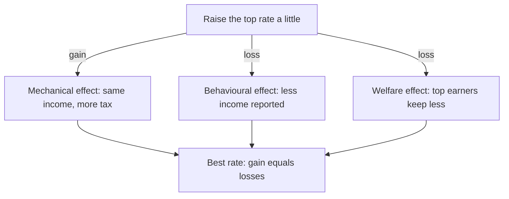

# How high should the top tax rate be?

*Three numbers you can measure settle one of the oldest fights in tax policy.*

Saez (2001) · Skim depth

In 2024 a single American pays 37 cents in federal tax on each dollar earned above $609,350. Some economists say that rate should be closer to 70%. Emmanuel Saez showed that the answer follows from just three numbers, and that most of the argument is really about one of them.

## Raise the rate a little, and three things happen

Saez does not search over every possible rate. He asks what happens if the current [[top-tax-rate|top rate]] rises by one small step.

The government gains, because top earners pay more on the same income. This is the [[mechanical-effect|mechanical effect]]. The government also loses, because some top earners report less income, so there is less to tax: the [[elasticity-of-taxable-income|behavioural response]]. Top earners lose as well, and how much that counts depends on how much society values their dollars.

*What to notice:* one gain and two losses. The best rate is where they balance, so a small step in either direction changes nothing.[^foc]

## The gain depends on how far top incomes reach

The top rate only taxes income above the top line, $\bar z$. Top incomes follow a [[pareto-tail|Pareto tail]], a shape set by one number $a$, and the average income above the line is

$$ z_m = \frac{a}{a-1}\,\bar z $$

Where:

- $z_m$ is the average income above the line.
- $a$ is the Pareto tail; small means fat.
- $\bar z$ is the line where the top rate starts.

(Source: p. N, sample)

With $a = 1.5$ the average top earner makes three times the line: about $1.8M against a $600k line, so the slice the top rate taxes is $1.2M.

## The loss depends on how much reported income shrinks

The [[elasticity-of-taxable-income|elasticity of taxable income]], $e$, measures the response. If the take-home share $1-\tau$ falls by 10%, reported income falls by $e \times 10\%$. Estimates run from about 0.1 to above 1.

> Most of the political fight over top rates is a fight over one number: $e$.

## The whole argument in symbols

Setting the gain equal to the two losses gives Saez's formula:

$$ \tau^* = \frac{1-\bar g}{1-\bar g+a\,e} $$

Where:

- $\tau^*$ is the best top marginal tax rate.
- $a$ is the Pareto tail and $e$ the elasticity of taxable income.
- $\bar g$ is the social value of a top earner's dollar.

(Source: eq. N, p. N, sample)

1. $1-\bar g$ is the gain from a small step, after counting what top earners lose at weight $\bar g$.
2. $a\,e$ is the loss: a fat tail (small $a$) shrinks it, a strong response (large $e$) grows it.
3. With $e = 0.25$, $a = 1.5$ and $\bar g = 0$: $\tau^* = 1/1.375 \approx 73\%$.

| Input | Value used | Where it comes from |
|---|---|---|
| $a$ | 1.5 | US tax data |
| $e$ | 0.25 | middle of the estimates |
| $\bar g$ | 0 | a value judgment |

*What to notice:* only $\bar g$ is not measured. It says how much a rich person's extra dollar matters, which no data set can tell you.

## What to doubt

The formula is **Established**: it follows from the model. The 73% is **Derived**: our arithmetic with chosen inputs. Treating $e$ as fixed is an **Interpretation**; much of the response is avoidance, which depends on how the tax is designed, so $e$ is partly a policy choice. Migration and income shifting abroad stay **Open**, because the model leaves them out. If $e$ is really 0.5, the same formula gives 57%, so the claim to test first is the value of $e$.

## In one sentence

The top rate should be high when top incomes are concentrated, top earners respond little, and society puts little weight on their extra dollar.

## Check yourself

> [!question]- If top earners stopped responding to taxes ($e = 0$), what would the best rate be?
> 100% when $\bar g = 0$, because raising the rate would never lose revenue.

> [!question]- Two economists agree on $a$ and $\bar g$ but recommend 45% and 75%. What do they disagree about?
> The elasticity $e$. The one at 45% believes top earners respond strongly.

> [!question]- Which input is a value judgment rather than a measurement?
> $\bar g$, the weight society puts on a top earner's extra dollar.

## Explain it back

Why does the elasticity decide the top rate? Write three to six sentences for a friend who never studied economics, then paste your answer to Claude.

[^foc]: Economists call this a first-order condition: at the best value, a small change gains nothing.
